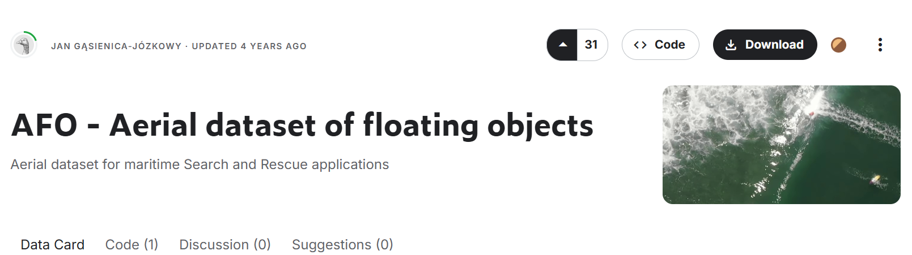
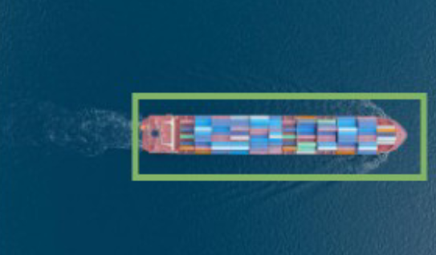

# ML START 2025 Intensive I

### Team project in hackathon style - multi class image classification and detection

---

# AFO Aerial Dataset of Floating Objects

**Dataset Link:** [AFO Aerial Dataset of Floating Objects](https://www.kaggle.com/datasets/jangsienicajzkowy/afo-aerial-dataset-of-floating-objects)

This solution can be useful for search and rescue applications.

---

## **What the Solution Does Algorithmically:**
- Performs **detection** and **classification** of floating objects on water surfaces.

---

## **Base Algorithms/Tools for Developing the Solution:**

### **Detection of Floating Objects:**
- **YOLOv5**
- **YOLOv8**
- **YOLOv10**
- **YOLOv11**

### **Classification of Floating Objects:**
- **ResNet-like classifiers** (ResNet-18, ResNet-34, ResNet-50, ResNet-152)
- **RegNet**
- **EfficientNet**

---

## **Functionality of the Solution:**

- **Distributed solution**
- **UI with image processing capabilities**
- **Display of processing results**:
  - Bounding box with class label (each class has its own color)
- **Logging of all actions**
- **Saving significant events to a database**:
  - Significant event: Detection of a key object in an image
- **Configuration and configuration management via UI**
- **Service availability display** (Healthcheck)
- **Visual indication of video processing**:
  - Active processing indicator (e.g., spinner, progress bar)
- **Processing of a directory with images**
- **Event log viewing**:
  - Source name, frame, algorithm metadata

---

## **Requirements and Evaluation Criteria:**

- **Functionality and completeness of task execution**
- **Ease of use**
- **Reliability and error tolerance**
- **Performance level**:
  - Ensure fast performance of services, algorithms, and UI for image processing in **no more than 300 ms**
- **Testing on sample images**

---

## **Example of a Processed Image:**



---

## **Code Example (Simplified):**

```python
# Example of object detection using YOLOv5
from ultralytics import YOLO

# Load the YOLOv5 model
model = YOLO("yolo11n.pt")

# Perform detection on an image
results = model("path/to/image.jpg")

# Display results
results.show()
```

---

## Dataset's article
**Title:** [An Ensemble Deep Learning Method with Optimized Weights for Drone-Based Water Rescue and Surveillance](https://www.researchgate.net/publication/348800810_An_ensemble_deep_learning_method_with_optimized_weights_for_drone-based_water_rescue_and_surveillance)

**Publication Date:** January 2021  
**Journal:** Integrated Computer-Aided Engineering  
**Volume:** 28  
**Issue:** 4  
**Pages:** 1–15  
**DOI:** [10.3233/ICA-210649](https://doi.org/10.3233/ICA-210649)  

**Authors:**  
- Jan Gąsienica-Józkowy  
- Mateusz Knapik  
- Boguslaw Cyganek  
